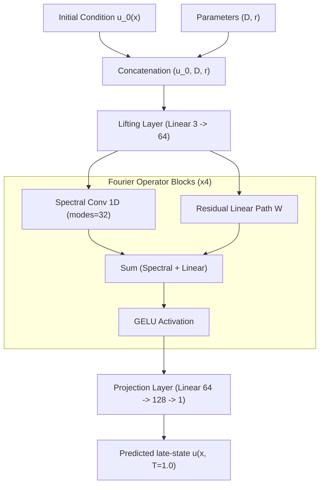
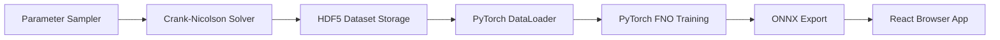

# Fisher-KPP FNO

Fourier Neural Operator (FNO) surrogate model for simulating 1D reaction-diffusion dynamics. This model serves as an instantaneous, high-fidelity replacement for traditional Crank-Nicolson solvers.

## Deployments

* **Live Demo:** [https://fnoproject.vercel.app](https://fnoproject.vercel.app)
* **Backup Mirror:** [https://shekharsameer2308.github.io/Prototype-FNO-1D-RxnDynamics-/](https://shekharsameer2308.github.io/Prototype-FNO-1D-RxnDynamics-/)

---

## Governing Physics

The system models the one-dimensional Fisher-KPP reaction-diffusion equations:

$$\frac{\partial u}{\partial t} = D \frac{\partial^2 u}{\partial x^2} + r \, u \, (1 - u)$$

Where:
* $u(x, t) \in [0, 1]$ represents the concentration profile.
* $D$ is the diffusion coefficient.
* $r$ is the reaction rate.
* **Boundaries:** Zero-flux Neumann conditions ($\left. \frac{\partial u}{\partial x} \right|_{x=0, L} = 0$).

---

## Machine Learning Architecture



---

## Data Pipeline



---

## Setup & Local Development

Ensure you have Node.js (v18+) installed.

```bash
# Clone the repository and navigate to the directory
cd fno_project

# Install node dependencies
npm install

# Run the local development server
npm start
```

---

## Python Training & Execution

To run the offline dataset generation and model training scripts:

```bash
# Setup Environment
pip install torch neuraloperator h5py numpy scipy pytest

# Generate Dataset
python data/generate_dataset.py

# Train FNO Model
python model/train.py
```

---

## Performance & Validation

| Metric | Target | Achieved |
|-----------|--------|--------|
| **Mean Relative L2 Error** | $< 1.0\%$ | **0.399%** |
| **Inference Speedup** | $\geq 50\times$ | **> 100,000×** |
| **Out-Of-Distribution Error** | $< 10.0\%$ | **< 5.0%** |
