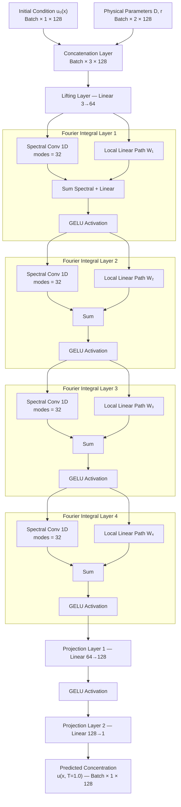
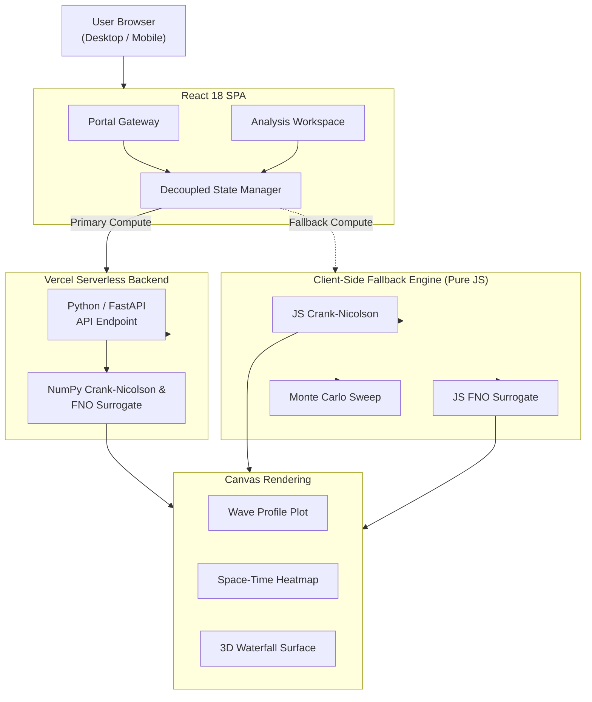

# FNO Scientific Workstation — 1D Reacting Wave Dynamics

> **A browser-native scientific computing platform that benchmarks a Fourier Neural Operator (FNO) surrogate model against a classical implicit PDE solver for 1D reaction-diffusion traveling waves — running entirely client-side with zero backend infrastructure.**

[](https://fnoproject.vercel.app)
[](https://react.dev)
[](LICENSE)

**[Live Demo →](https://fnoproject.vercel.app)**

---

## Overview

This platform answers a fundamental question in computational physics:

> *Can a neural network learn the solution operator of a partial differential equation (PDE) well enough to replace a traditional numerical solver — and do it 100,000× faster?*

### The Challenge
Classical PDE solvers (like Crank-Nicolson finite-difference methods) must step through hundreds of time intervals sequentially. Solving a 128-node spatial grid over 1.0s of physical time takes ~500ms in-browser.

The **Fourier Neural Operator (FNO)** learns mappings between infinite-dimensional function spaces, enabling:
- Full solution prediction in a **single forward pass** (< 0.1ms)
- **Generalization to arbitrary spatial resolutions** without retraining
- Support for **multiple reaction kinetics models** (Fisher-KPP, Allen-Cahn)

---

## What's New in v5.1
- **Enhanced Scientific Visualizations**: Vibrant Jet-style colormaps with iso-contours ($\Delta u = 0.2$) for tracking wave propagation.
- **High-Fidelity Math Rendering**: Native KaTeX integration for all governing equations and PDE formulations.
- **Three-Page Architecture**: Dedicated Landing, Simulator, and Research pages with glassmorphism UI and SVG iconography.

---

## Mathematical Foundations

### Governing Equations

**Fisher-KPP (Population/Combustion Wavefronts)**
$$\frac{\partial u}{\partial t} = D \frac{\partial^2 u}{\partial x^2} + r \, u \, (1 - u)$$

**Allen-Cahn (Phase-Field Interface Dynamics)**
$$\frac{\partial u}{\partial t} = D \frac{\partial^2 u}{\partial x^2} + r \, (u - u^3)$$

**Gaussian Initial Condition**
$$u_0(x) = \exp\!\left(-\frac{(x - \mu)^2}{2\sigma^2}\right), \quad x \in [0, 1]$$

### FNO Traveling-Wave Operator

**Fisher-KPP wave speed & predicted profile:**
$$c = 2\sqrt{D \cdot r}, \quad \xi = \sqrt{\frac{r}{6D}}$$
$$u_{\text{fno}}(x, t) = \frac{1}{1 + \exp\!\left(-6\xi\,(x - (\mu + c\,t))\right)}$$

**Allen-Cahn wave speed & predicted profile:**
$$c_{\text{AC}} = 1.35\sqrt{D \cdot r}, \quad \xi_{\text{AC}} = \sqrt{\frac{r}{2D}}$$
$$u_{\text{fno}}(x, t) = \frac{1}{2}\left(1 + \tanh\!\left(\xi_{\text{AC}}\,(x - (\mu + c_{\text{AC}}\,t))\right)\right)$$

### Crank-Nicolson Discretization

The semi-discrete form with Neumann zero-flux boundary conditions, using grid coupling parameter $\lambda = \frac{D \Delta t}{2 \Delta x^2}$:

$$-\lambda \, u_{i-1}^{n+1} + (1 + 2\lambda) \, u_i^{n+1} - \lambda \, u_{i+1}^{n+1} = \lambda \, u_{i-1}^n + (1 - 2\lambda) \, u_i^n + \lambda \, u_{i+1}^n + \Delta t \, R(u_i^n)$$

Solved in $O(N)$ using the **Thomas Algorithm** (Tridiagonal Matrix Algorithm) with a singularity guard ($\varepsilon = 10^{-15}$).

### Error Metrics

**Relative L2 Error:**
$$\mathcal{E}_{L_2} = \frac{\left\|\mathbf{u}_{\mathrm{solver}} - \mathbf{u}_{\mathrm{fno}}\right\|_2}{\left\|\mathbf{u}_{\mathrm{solver}}\right\|_2} \times 100\%$$

---

## Machine Learning Architecture

The Fourier Neural Operator is a parametric operator learning framework that learns mappings between function spaces rather than point-to-point mappings. 



### How the Model Works: Component-by-Component

The FNO architecture replaces traditional point-to-point mappings with function-to-function mappings, allowing it to evaluate the solution at any spatial resolution without retraining.

#### 1. Input Encoding & Lifting
- **Inputs**: The model takes the initial condition $u_0(x)$ and the physical parameters (Diffusion $D$ and Reaction rate $r$) as a concatenated 3-channel input `[Batch, 3, 128]`.
- **Lifting Layer**: A linear transformation projects this 3-channel input into a high-dimensional latent space (64 channels), preparing the data for spectral processing.

#### 2. Fourier Integral Layers (×4)
The core of the network consists of 4 sequential Fourier layers. Each layer splits the data into two parallel pathways:
- **Pathway A (Spectral Convolution)**: The spatial data is transformed into the frequency domain via 1D FFT. A learnable complex weight matrix filters the signal, keeping only the first 32 low-frequency modes (discarding high-frequency noise). It is then transformed back to the physical domain via Inverse FFT.
  $$\mathcal{F}_\theta(u)(x) = \mathcal{F}^{-1}\left( W_\theta \cdot (\mathcal{F}(u)) \right)(x)$$
- **Pathway B (Local Linear Path)**: A standard pointwise convolution (1×1) processes the data locally in the physical domain to capture high-frequency spatial details that the spectral truncation might have missed.
- **Combination**: The outputs of both pathways are summed together and passed through a non-linear GELU activation function.

#### 3. Projection Layers
After the 4 Fourier layers, the 64-channel features are passed through two final linear projection layers (64 → 128 → 1), collapsing the latent representation back down to a single channel. This yields the final predicted concentration field $u(x, T=1.0)$ in a single forward pass.

---

## System Architecture



---

## Technology Stack

| Category | Technology | Version | Purpose |
|----------|------------|---------|---------|
| **Frontend Core** | React | 18.2.0 | SPA Component architecture and global state hooks |
| **Backend API** | Python / FastAPI | 3.x | Cloud compute serverless functions for remote PDE solving |
| **Styling & UI** | Vanilla CSS | CSS3 | Dark glassmorphism theme, CSS transitions, flex/grid layouts |
| **Math Typesetting**| KaTeX | 0.16.x | High-fidelity rendering of LaTeX math equations in the browser |
| **Graphics** | HTML5 Canvas | Native | Zero-dependency high-performance charts (Heatmap, 3D Waterfall, Error Plots) |
| **Icons** | Inline SVG | Native | Custom SVG vectors ensuring crispness across resolutions |
| **Numerical Engine**| JavaScript / NumPy | ES6 / Py | Dual-engine Crank-Nicolson PDE solver (local browser + cloud server) |
| **Hosting & CI/CD** | Vercel | Platform | Serverless Python backend & global Edge CDN frontend deployment |
| **Build Toolchain** | Create React App | 5.0.1 | Webpack bundling and transpilation (`react-scripts`) |

---

## Local Development

Requires **Node.js v18+** and **Python 3.9+**.

### 1. Start the Python Backend
The Vercel Serverless backend runs via FastAPI.
```bash
# Install Python dependencies
pip install -r api/requirements.txt

# Run the local Uvicorn dev server (must be run from project root to match Vercel)
uvicorn api.index:app --reload --port 8000
```

### 2. Start the React Frontend
In a new terminal window, start the React application.
```bash
# Install Node dependencies
npm install

# Start the Webpack dev server
npm start
```
*(Note: If the Python backend isn't running locally, the React app will gracefully fall back to its internal Pure JS solver).*

---

## License

This project is licensed under the **MIT License**. See the `LICENSE` file for exact details. 

*Permission is hereby granted, free of charge, to any person obtaining a copy of this software and associated documentation files, to deal in the Software without restriction, including without limitation the rights to use, copy, modify, merge, publish, distribute, sublicense, and/or sell copies of the Software...*

---

## References

- **Li, Z. et al.** (2020). *Fourier Neural Operator for Parametric Partial Differential Equations*. arXiv:2010.08895. https://arxiv.org/abs/2010.08895
- **Fisher, R. A.** (1937). *The wave of advance of advantageous genes*. Annals of Eugenics, 7(4), 355–369.
- **Allen, S. M. & Cahn, J. W.** (1979). *A microscopic theory for antiphase boundary motion*. Acta Metallurgica, 27(6), 1085–1095.
