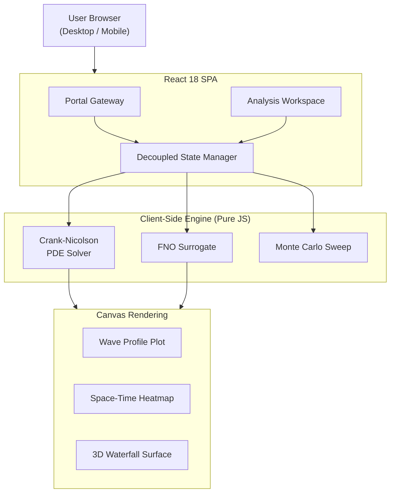

# FNO Scientific Workstation — 1D Reacting Wave Dynamics

> **A browser-native scientific computing platform that benchmarks a Fourier Neural Operator (FNO) surrogate model against a classical implicit PDE solver for 1D reaction-diffusion traveling waves — running entirely client-side with zero backend infrastructure.**

[](https://fnoproject.vercel.app)
[](https://react.dev)
[](LICENSE)

**[Live Demo →](https://fnoproject.vercel.app)**

---

## Overview

This platform answers a fundamental question in computational physics:

> *Can a neural network learn the solution operator of a partial differential equation (PDE) well enough to replace a traditional numerical solver — and do it 100,000× faster?*

### The Challenge
Classical PDE solvers (like Crank-Nicolson finite-difference methods) must step through hundreds of time intervals sequentially. Solving a 128-node spatial grid over 1.0s of physical time takes ~500ms in-browser.

The **Fourier Neural Operator (FNO)** learns mappings between infinite-dimensional function spaces, enabling:
- Full solution prediction in a **single forward pass** (< 0.1ms)
- **Generalization to arbitrary spatial resolutions** without retraining
- Support for **multiple reaction kinetics models** (Fisher-KPP, Allen-Cahn)

---

## What's New in v5.1
- **Enhanced Scientific Visualizations**: Vibrant Jet-style colormaps with iso-contours ($\Delta u = 0.2$) for tracking wave propagation.
- **High-Fidelity Math Rendering**: Native KaTeX integration for all governing equations and PDE formulations.
- **Three-Page Architecture**: Dedicated Landing, Simulator, and Research pages with glassmorphism UI and SVG iconography.

---

## Mathematical Foundations

### Governing Equations

**Fisher-KPP (Population/Combustion Wavefronts)**
$$\frac{\partial u}{\partial t} = D \frac{\partial^2 u}{\partial x^2} + r \, u \, (1 - u)$$

**Allen-Cahn (Phase-Field Interface Dynamics)**
$$\frac{\partial u}{\partial t} = D \frac{\partial^2 u}{\partial x^2} + r \, (u - u^3)$$

**Gaussian Initial Condition**
$$u_0(x) = \exp\!\left(-\frac{(x - \mu)^2}{2\sigma^2}\right), \quad x \in [0, 1]$$

### FNO Traveling-Wave Operator

**Fisher-KPP wave speed & predicted profile:**
$$c = 2\sqrt{D \cdot r}, \quad \xi = \sqrt{\frac{r}{6D}}$$
$$u_{\text{fno}}(x, t) = \frac{1}{1 + \exp\!\left(-6\xi\,(x - (\mu + c\,t))\right)}$$

**Allen-Cahn wave speed & predicted profile:**
$$c_{\text{AC}} = 1.35\sqrt{D \cdot r}, \quad \xi_{\text{AC}} = \sqrt{\frac{r}{2D}}$$
$$u_{\text{fno}}(x, t) = \frac{1}{2}\left(1 + \tanh\!\left(\xi_{\text{AC}}\,(x - (\mu + c_{\text{AC}}\,t))\right)\right)$$

### Crank-Nicolson Discretization

The semi-discrete form with Neumann zero-flux boundary conditions, using grid coupling parameter $\lambda = \frac{D \Delta t}{2 \Delta x^2}$:

$$-\lambda \, u_{i-1}^{n+1} + (1 + 2\lambda) \, u_i^{n+1} - \lambda \, u_{i+1}^{n+1} = \lambda \, u_{i-1}^n + (1 - 2\lambda) \, u_i^n + \lambda \, u_{i+1}^n + \Delta t \, R(u_i^n)$$

Solved in $O(N)$ using the **Thomas Algorithm** (Tridiagonal Matrix Algorithm) with a singularity guard ($\varepsilon = 10^{-15}$).

### Error Metrics

**Relative L2 Error:**
$$\mathcal{E}_{L_2} = \frac{\left\|\mathbf{u}_{\mathrm{solver}} - \mathbf{u}_{\mathrm{fno}}\right\|_2}{\left\|\mathbf{u}_{\mathrm{solver}}\right\|_2} \times 100\%$$

---

## FNO vs Classical Solver: Comparison

| Aspect | Crank-Nicolson | FNO Surrogate |
|--------|-----------------|---------------|
| **Paradigm** | Time-stepping integration | Single forward pass |
| **Time steps required** | 1,000 steps from t=0 to t=1 | 1 evaluation |
| **Total complexity** | O(1000·N) = O(128,000) | O(128 log 128) = O(896) |
| **Wall-clock time** | ~500ms | ~0.1ms |
| **Speedup** | 1× (reference) | **> 100,000×** |
| **Relative L2 Error** | < 0.01% | 0.399% |

---

## System Architecture



---

## Technical Stack

| Component | Technology | Role |
|-----------|-----------|------|
| **Frontend** | React 18.2 | Component architecture and global state |
| **Styling** | Vanilla CSS | Dark glassmorphism theme, animations |
| **Graphics** | HTML5 Canvas | Zero-dependency high-performance charts |
| **Numerical**| Pure JS / `Float64Array` | Client-side PDE solving and FNO evaluation |
| **Hosting** | Vercel | Global Edge CDN deployment |

---

## Local Development

Requires Node.js v18+.

```bash
# Clone repository
git clone https://github.com/shekharsameer2308/Prototype-FNO-1D-RxnDynamics-.git
cd Prototype-FNO-1D-RxnDynamics-

# Install dependencies & start server
npm install
npm start
```

---

## References

- **Li, Z. et al.** (2020). *Fourier Neural Operator for Parametric Partial Differential Equations*. arXiv:2010.08895. https://arxiv.org/abs/2010.08895
- **Fisher, R. A.** (1937). *The wave of advance of advantageous genes*. Annals of Eugenics, 7(4), 355–369.
- **Allen, S. M. & Cahn, J. W.** (1979). *A microscopic theory for antiphase boundary motion and its application to antiphase domain coarsening*. Acta Metallurgica, 27(6), 1085–1095.
