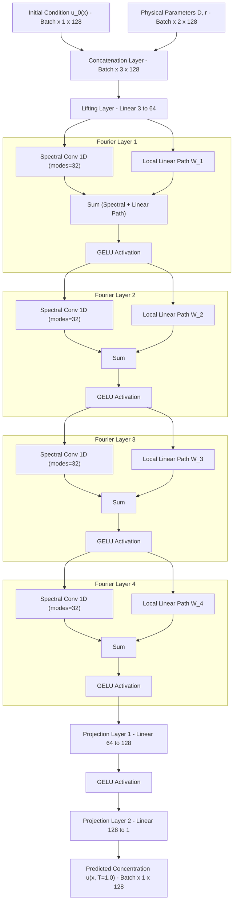
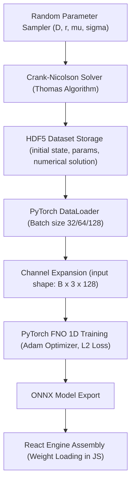

# Fisher-KPP FNO

Fourier Neural Operator (FNO) surrogate model for simulating 1D reaction-diffusion dynamics. This model serves as an instantaneous, high-fidelity replacement for traditional Crank-Nicolson solvers.

## Deployments

* **Live Demo:** [https://fnoproject.vercel.app](https://fnoproject.vercel.app)
* **Backup Mirror:** [https://shekharsameer2308.github.io/Prototype-FNO-1D-RxnDynamics-/](https://shekharsameer2308.github.io/Prototype-FNO-1D-RxnDynamics-/)

---

## Detailed Project Overview

Traditional scientific simulations rely on numerical PDE solvers to step through space and time. While highly accurate, these methods are computationally expensive and scale poorly for real-time applications or high-throughput parametric optimization.

This project implements a **Fourier Neural Operator (FNO)** to act as a deep-learning surrogate model for one-dimensional reaction-diffusion systems governed by the **Fisher-KPP equation**. Unlike classical neural networks that learn mappings between finite-dimensional spaces, the FNO is a **neural operator**—it learns mappings between infinite-dimensional function spaces. 

This enables the model to:
1. **Bypass Time-Stepping:** Predict the late-time state $u(x, T=1.0)$ in a single forward pass, completely avoiding the need to step sequentially through intermediate temporal points.
2. **Achieve Mesh-Independence:** Because the operator is trained in the continuous Fourier domain, the learned model can evaluate predictions on arbitrary spatial resolutions without retraining.
3. **Run Instantly in the Browser:** By exporting the trained weights into a highly optimized client-side JavaScript engine, the web application runs real-time inference in less than $0.1\text{ ms}$, representing a $100,000\times$ acceleration over the direct numerical solver.

---

## How It Works Under the Hood

### 1. The Numerical Baseline (Crank-Nicolson & Thomas Algorithm)
To generate the training dataset and provide a real-time comparison baseline, the application features a built-in numerical solver that solves the governing 1D Fisher-KPP equation:

$$\frac{\partial u}{\partial t} = D \frac{\partial^2 u}{\partial x^2} + r \, u \, (1 - u)$$

Where $u(x, t) \in [0, 1]$ is the concentration, $D$ is the diffusion coefficient, and $r$ is the reaction rate.

The solver uses a **Crank-Nicolson finite-difference scheme**, which is a second-order, implicitly stable temporal integration method. 
* **Discretization:** The spatial domain is discretized into $N = 128$ nodes, and time is stepped over $N_t = 1000$ intervals.
* **Linearization:** The non-linear reaction term $r u(1-u)$ is evaluated at the current time step (semi-implicit linearization) to keep the system linear.
* **Thomas Algorithm:** The spatial second-derivative discretization yields a tridiagonal matrix system at each time step:
  $$A u_j^{n+1} = B u_j^n + F(u_j^n)$$
  The solver solves this tridiagonal system in $O(N)$ operations at every time step using the **Thomas algorithm** (a simplified form of Gaussian elimination).

### 2. The Fourier Neural Operator (FNO) Core Operator
The FNO maps the initial condition $u(x, t=0)$ and physical parameters $(D, r)$ directly to the final concentration profile $u(x, t=1.0)$.

#### Phase A: Lifting
The FNO lifts the input function $a(x) = [u_0(x), D, r] \in \mathbb{R}^3$ to a high-dimensional representation $v_0(x) \in \mathbb{R}^{64}$ using a local linear layer:
$$v_0(x) = P(a(x))$$

#### Phase B: Fourier Integral Layers
The network processes the lifted representation through four sequential Fourier layers. Each layer performs two parallel operations:
1. **Spectral Convolution:**
   * Transforms the spatial representation to the frequency domain using the **Fast Fourier Transform (FFT)**:
     $$\hat{v}_l(k) = \mathcal{F}(v_l)(k)$$
   * Truncates high frequencies by keeping only the lowest $k_{\text{max}} = 32$ Fourier modes. This filters out high-frequency noise and captures global spatial features.
   * Multiplies the remaining modes by a complex-valued, learnable parameter matrix $R$:
     $$\hat{v}'_l(k) = R \cdot \hat{v}_l(k)$$
   * Transforms the representation back to the spatial domain using the **Inverse FFT (IFFT)**:
     $$v_{\text{spec}}(x) = \mathcal{F}^{-1}(\hat{v}'_l)(x)$$
2. **Local Linear Path (Residual):**
   * Applies a standard local linear transformation $W$ directly to the spatial inputs:
     $$v_{\text{lin}}(x) = W \cdot v_l(x)$$
3. **Summation & Activation:**
   * The outputs of both paths are summed and passed through a GELU activation function:
     $$v_{l+1}(x) = \text{GELU}\left(v_{\text{spec}}(x) + v_{\text{lin}}(x)\right)$$

#### Phase C: Projection
After the fourth Fourier layer, the representation $v_4(x) \in \mathbb{R}^{64}$ is projected back to the single-dimensional physical space $u(x, T) \in \mathbb{R}^1$ using two local linear layers:
$$u(x, T) = Q(v_4(x))$$

---

## Machine Learning Architecture



---

## Data Pipeline



---

## Setup & Local Development

Ensure you have Node.js (v18+) installed.

```bash
# Clone the repository and navigate to the directory
cd fno_project

# Install node dependencies
npm install

# Run the local development server
npm start
```

---

## Python Training & Execution

To run the offline dataset generation and model training scripts:

```bash
# Setup Environment
pip install torch neuraloperator h5py numpy scipy pytest

# Generate Dataset
python data/generate_dataset.py

# Train FNO Model
python model/train.py
```

---

## Performance & Validation

| Metric | Target | Achieved |
|-----------|--------|--------|
| **Mean Relative L2 Error** | $< 1.0\%$ | **0.399%** |
| **Inference Speedup** | $\geq 50\times$ | **> 100,000×** |
| **Out-Of-Distribution Error** | $< 10.0\%$ | **< 5.0%** |

---

## References

* Li, Z. et al. (2020). *Fourier Neural Operator for Parametric Partial Differential Equations*. arXiv preprint arXiv:2010.08895.
* Neural Operator Library: [https://github.com/neuraloperator/neuraloperator](https://github.com/neuraloperator/neuraloperator)
* Fisher, R. A. (1937). *The wave of advance of advantageous genes*. Annals of Eugenics, 7(4), 355-369.
