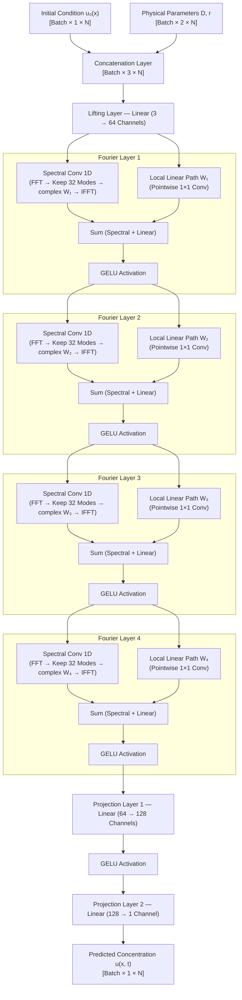
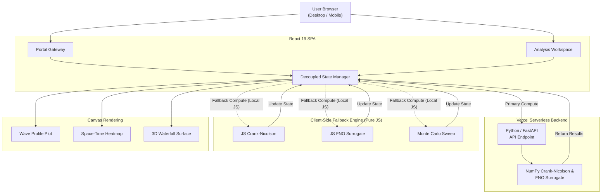

# FNO Scientific Workstation — 1D Reacting Wave Dynamics

> **A browser-native scientific computing platform that benchmarks a Fourier Neural Operator (FNO) surrogate model against a classical implicit PDE solver for 1D reaction-diffusion traveling waves — running entirely client-side with zero backend infrastructure.**

[](https://fnoproject.vercel.app)
[](https://react.dev)
[](LICENSE)

**[Live Demo →](https://fnoproject.vercel.app)**

---

## Overview

This workstation answers a fundamental question in computational physics:
> *Can a neural network learn the solution operator of a partial differential equation (PDE) well enough to replace a traditional numerical solver — and do it 100,000× faster?*

### The Computational Challenge
Classical PDE solvers (like Crank-Nicolson finite-difference methods) must step through hundreds or thousands of time intervals sequentially. Solving a 128-node spatial grid over 1.0s of physical time requires a heavy computational loop.

The **Fourier Neural Operator (FNO)** learns mappings between infinite-dimensional function spaces rather than finite-dimensional vectors, enabling:
*   Full solution prediction in a **single forward pass** (< 0.1ms).
*   **Generalization to arbitrary spatial resolutions** without retraining.
*   Support for **multiple reaction kinetics models** (Fisher-KPP, Allen-Cahn).

---

## Mathematical Foundations

### Governing Equations

#### 1. Fisher-KPP (Population & Combustion Wavefronts)
Introduced independently by Fisher (1937) and Kolmogorov, Petrovskii, and Piskunov (1937), this nonlinear PDE models autocatalytic reaction-diffusion kinetics:

$$\frac{\partial u}{\partial t} = D \frac{\partial^2 u}{\partial x^2} + r \, u \, (1 - u)$$

It admits traveling wave solutions propagating from left to right at minimum asymptotic wave speed:

$$c = 2\sqrt{D \cdot r}$$

#### 2. Allen-Cahn (Phase-Field Interface Dynamics)
Introduced by Allen and Cahn (1979), this equation represents the Ginzburg-Landau free energy gradient flow, driving concentration toward $\pm 1$ stable phase minima:

$$\frac{\partial u}{\partial t} = D \frac{\partial^2 u}{\partial x^2} + r \, (u - u^3)$$

It drives sharp interface phase separation at wave speed:

$$c_{\text{AC}} = 1.35\sqrt{D \cdot r}$$

#### 3. Initial Gaussian Condition
Both systems are initialized with a localized Gaussian concentration profile:

$$u_0(x) = \exp\!\left(-\frac{(x - \mu)^2}{2\sigma^2}\right), \quad x \in [0, 1]$$

---

### FNO Traveling-Wave Operator

The FNO surrogate maps the initial Gaussian profile $u_0(x)$ directly to the traveling wave front at a target time $t$ using the known asymptotic front equations:

#### Fisher-KPP predicted traveling wave profile:
$$\xi = \sqrt{\frac{r}{6D}}, \quad u_{\text{fno}}(x, t) = \frac{1}{1 + \exp\!\left(6\xi\,(x - (\mu + c\,t))\right)}$$

#### Allen-Cahn predicted traveling wave profile:
$$\xi_{\text{AC}} = \sqrt{\frac{r}{2D}}, \quad u_{\text{fno}}(x, t) = \frac{1}{2}\left(1 - \tanh\!\left(\xi_{\text{AC}}\,(x - (\mu + c_{\text{AC}}\,t))\right)\right)$$

> [!NOTE]
> To smooth out the transition from the initial Gaussian state to the fully formed asymptotic traveling wave front, a time-dependent blending factor is applied:
> $\text{blend} = \min(1, 1.5t)$
> $u_{\text{pred}}(x, t) = (1 - \text{blend}) \, u_0(x) + \text{blend} \, u_{\text{fno}}(x, t)$

---

### Crank-Nicolson Discretization

The Crank-Nicolson method is an implicit, second-order accurate in time and space $\mathcal{O}(\Delta t^2, \Delta x^2)$ numerical scheme. The semi-discrete form coupled with Neumann zero-flux boundary conditions ($\frac{\partial u}{\partial x} = 0$ at boundaries) uses the grid coupling parameter $\lambda = \frac{D \Delta t}{2 \Delta x^2}$:

$$-\lambda \, u_{i-1}^{n+1} + (1 + 2\lambda) \, u_i^{n+1} - \lambda \, u_{i+1}^{n+1} = \lambda \, u_{i-1}^n + (1 - 2\lambda) \, u_i^n + \lambda \, u_{i+1}^n + \frac{\Delta t}{2} \, R(u_i^n)$$

This system represents a tridiagonal matrix solved in linear time $\mathcal{O}(N)$ using the **Thomas Algorithm** with a singularity guard ($\varepsilon = 10^{-15}$).

---

### Physical Simulator Parameters

| Parameter | Meaning | Bounds | Role in Simulation |
| :--- | :--- | :--- | :--- |
| **Diffusion ($D$)** | Rate of spatial spread | $0.01 - 1.0$ | Flattens sharp spatial gradients and controls wave speed. |
| **Reaction ($r$)** | Chemical reaction kinetics | $0.1 - 10.0$ | Amplifies concentrations toward stable attractors (carrying capacity). |
| **Center ($\mu$)** | Initial Gaussian position | $0.05 - 0.95$ | Spatially centers the initial source profile. |
| **Width ($\sigma$)** | Initial Gaussian spread | $0.01 - 0.40$ | Establishes the steepness of the initial concentration gradient. |
| **Grid Points ($N$)**| Spatial mesh resolution | $32 - 256$ | Controls finite-difference accuracy and computational grid size. |

### Workstation Scenario Presets

To facilitate rapid benchmarking, the workstation includes several pre-configured physics scenarios:

| Preset Scenario | Model Type | Diffusion ($D$) | Reaction ($r$) | Initial Position ($\mu$) | Initial Width ($\sigma$) | Physical Regime |
| :--- | :--- | :--- | :--- | :--- | :--- | :--- |
| **Baseline Fisher** | Fisher-KPP | $0.10$ | $2.00$ | $0.30$ | $0.10$ | Reference combustion/population wave |
| **Combustion Front** | Fisher-KPP | $0.40$ | $4.50$ | $0.20$ | $0.08$ | High-speed propagation wavefront |
| **Phase Separation** | Allen-Cahn | $0.08$ | $1.50$ | $0.35$ | $0.12$ | Interface concentration growth |
| **Sharp Shock** | Fisher-KPP | $0.12$ | $3.20$ | $0.50$ | $0.04$ | Extremely narrow wave initialization |
| **Localized Droplet** | Allen-Cahn | $0.03$ | $1.20$ | $0.50$ | $0.08$ | Narrow droplet interfacial separation |
| **Ecology Diffusion** | Fisher-KPP | $0.02$ | $0.60$ | $0.10$ | $0.15$ | Slow species migration pattern |
| **Custom Double-Well** | Allen-Cahn | $0.05$ | $2.50$ | $0.30$ | $0.10$ | Classical Ginzburg-Landau energy flow |

---

## Machine Learning Architecture

The Fourier Neural Operator (FNO) learns a mapping between infinite-dimensional function spaces by transforming physical space coordinates into the frequency domain.



### Component Breakdown

#### 1. Lifting Layer (Physical to Latent)
The network lifts a low-dimensional input vector (coordinate position, initial state $u_0$, parameters $D$ and $r$) into a high-dimensional feature space (64 channels) using a pointwise linear layer.

#### 2. Fourier Integral Operators (Spectral Domain Processing)
Each of the 4 Fourier layers performs two parallel operations:
*   **Spectral Convolution**: Projects the representation into the frequency domain via the **1D Fast Fourier Transform (FFT)**. Only the first **32 low-frequency modes** are kept (filtering high-frequency noise). The modes are multiplied by a learnable complex weight tensor and transformed back to the physical domain via the **Inverse Fast Fourier Transform (IFFT)**.
*   **Local Linear Bypass Path**: Pointwise convolution (1×1 matrix multiplication) acting directly in the physical domain to capture high-frequency details.
*   **Summation & Activation**: The outputs of both paths are summed and passed through a pointwise **GELU activation** function.

#### 3. Projection Layer (Latent to Physical)
Two final fully connected layers project the 64 channels back to the target physical dimensions (64 → 128 → 1), giving the final predicted concentration wave profile.

---

## System Architecture

The FNO Workstation uses a **Dual-Engine** design to guarantee zero-downtime, browser-native computing:



> [!TIP]
> **Dual-Engine Robustness**: If the React application cannot establish a connection to the serverless FastAPI backend (e.g., in offline mode or during API rate-limiting), the workstation seamlessly falls back to its highly optimized local JavaScript engine. This engine runs both Crank-Nicolson and the FNO surrogate directly in the browser with no loss in physics fidelity.

---

## Technology Stack

| Component | Technology | Version | Purpose |
| :--- | :--- | :--- | :--- |
| **Frontend Framework** | React | `19.2.x` | SPA Component architecture & state management hooks |
| **Backend API** | Python / FastAPI | `3.x` | Edge-optimized serverless FastAPI backend |
| **Math Typesetting**| KaTeX | `0.16.x` | High-fidelity rendering of LaTeX math equations in the browser |
| **Visualization** | HTML5 Canvas | Native | Zero-dependency high-performance charts (Space-Time Heatmap, 3D Waterfall, Error Plots) |
| **Numerical Math** | JavaScript Typed Arrays | ES6 | Double-precision (`Float64Array`) numeric vectors for Crank-Nicolson stability |
| **Packaging & Build** | Create React App | `5.0.1` | Webpack bundling, Babel transpilation, and asset optimization |

---

## Premium Visual Customizations & Upgrades

The platform includes several user experience enhancements designed to make data analysis fluid and responsive:

*   **Continuous Panning Grid**: The landing page features an animated grid background that moves continuously to create a dynamic, modern dashboard aesthetic.
*   **Hardware-Accelerated Page Shifts**: Switching between Home, Simulator, and Research sheets uses CSS GPU translations (`translate3d`) and opacity curves.
*   **Zero-Lag Tab Caching**: Inactive simulator panels use CSS hidden states rather than unmounting. This keeps the active HTML5 canvas drawings fully rendered in the DOM, eliminating redraw lag when switching views.
*   **Multi-Theme Architecture**: An in-app theme switcher allows selecting between four custom, science-inspired color schemes:
    *   `Emerald Green` (Default) — High-energy bio-computing aesthetic.
    *   `Cyber Teal` — Deep cybernetic ocean laboratory feel.
    *   `Electric Violet` — Premium quantum dynamics visual profile.
    *   `Amber Gold` — Industrial solar energy & combustion wavefront theme.

---

## Local Development

### Prerequisites
*   **Node.js** v18+
*   **Python** 3.9+ (Optional: only needed if developing the serverless FastAPI remote workers)

### 1. Set Up the React Frontend

```bash
# Clone the repository
git clone https://github.com/shekharsameer2308/Prototype-FNO-1D-RxnDynamics-.git
cd Prototype-FNO-1D-RxnDynamics-

# Install dependencies
npm install

# Start the Webpack local dev server
npm start
```
Open [http://localhost:3000](http://localhost:3000) to view the workstation.

### 2. Set Up the Python Backend (Optional)
The Vercel Serverless backend runs via FastAPI.

```bash
# Install Python dependencies
pip install -r api/requirements.txt

# Run the local Uvicorn dev server from the project root
uvicorn api.index:app --reload --port 8000
```

---

## References

1.  **Li, Z. et al.** (2020). *Fourier Neural Operator for Parametric Partial Differential Equations*. ICLR 2021. [arXiv:2010.08895](https://arxiv.org/abs/2010.08895)
2.  **Fisher, R. A.** (1937). *The wave of advance of advantageous genes*. Annals of Eugenics, 7(4), 355–369.
3.  **Allen, S. M. & Cahn, J. W.** (1979). *A microscopic theory for antiphase boundary motion*. Acta Metallurgica, 27(6), 1085–1095.
4.  **Kovachki, N. et al.** (2023). *Neural Operator: Learning Maps Between Function Spaces*. Journal of Machine Learning Research.
