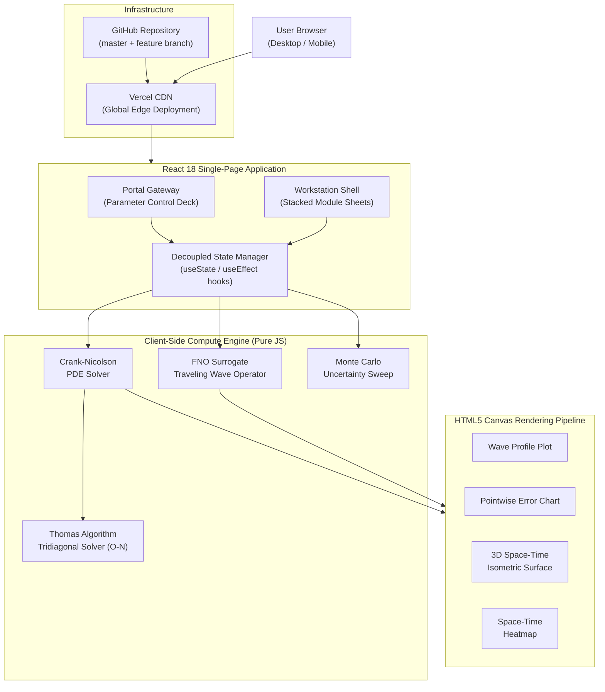
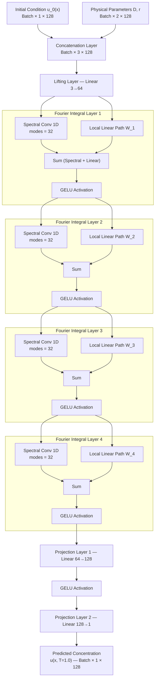
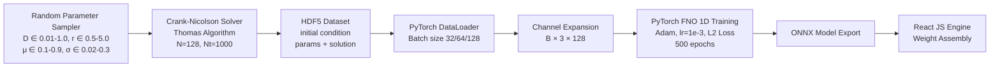

# FNO Scientific Workstation — 1D Reacting Wave Dynamics

> **A browser-native scientific computing platform that benchmarks a Fourier Neural Operator (FNO) surrogate model against a classical implicit PDE solver for 1D reaction-diffusion traveling waves — running entirely client-side with zero backend infrastructure.**

[](https://fnoproject.vercel.app)
[](https://react.dev)
[](LICENSE)

**Live Demo →** [https://fnoproject.vercel.app](https://fnoproject.vercel.app)

---

## ✨ v5.0 — Multi-Page Grey/Green Redesign (May 2026)

This release introduces a complete frontend redesign with a **three-page multi-page architecture** and a refined **dark grey & green** design system, replacing the previous single-page cyberpunk/teal theme.

### What Changed

#### 🎨 New Design System
- **Color palette**: Deep charcoal backgrounds (`#0f1210`) with vibrant green accents (`#4ade80`, `#6ee7b7`)
- **Typography**: [Space Grotesk](https://fonts.google.com/specimen/Space+Grotesk) for headings + JetBrains Mono for code/data
- **Glassmorphism panels** with green-tinted borders and subtle glow effects
- Green-spectrum canvas colormap (replaces inferno heatmap) for heatmap/waterfall charts

#### 🗺️ New Three-Page Navigation
| Page | Route | Description |
|------|--------|-------------|
| **Landing** | `/` (Home) | Hero section, stats bar, feature grid, equation showcase, CTA |
| **Simulator** | Simulator tab | Full parameter sidebar + 7-tab analysis workspace |
| **Research** | Research tab | Theory cards, FNO pipeline diagram, references, tech stack |

#### 🏠 Landing Page
- Full-screen hero with animated grid background and gradient headline
- Live IC preview canvas embedded in a browser-mockup preview card
- Stats strip: 100–500× speedup · <0.1ms FNO latency · <2% L2 error · 2 PDE models
- Feature cards for all 6 platform capabilities
- Side-by-side Fisher-KPP / Allen-Cahn equation showcase
- CTA section + footer with page navigation

#### ⚡ Simulator Page (7 tabs)
1. **Results** — metrics strip, animation timeline, 4-panel plot grid (solution, error, final profile, heatmap)
2. **Heatmap** — full-width interactive space-time map with crosshair HUD
3. **3D View** — pseudo-3D isometric waterfall plot
4. **MC Sweep** — Monte Carlo 50-sample ensemble with histogram charts
5. **Grid Conv.** — N=32/64/128/256 mesh convergence table
6. **Upload Data** — CSV experimental data fitting
7. **Python Code** — syntax-highlighted implementation reference

#### 📚 Research Page
- 4-card theory grid (Fisher-KPP, Allen-Cahn, Crank-Nicolson, FNO surrogate)
- Step-by-step FNO pipeline: Lift → Fourier Layer → Activation → Project
- 5 annotated academic references
- Technology stack cards

#### 🌐 Global Navbar
- Sticky persistent navbar with live uptime counter
- Active page indicator with green underline
- "Launch Sim →" quick-access CTA button

---


## What Is This Website?

This platform is an **interactive scientific workstation** that lets you explore a cutting-edge question in computational physics:

> *Can a neural network learn the solution operator of a partial differential equation (PDE) well enough to replace a traditional numerical solver — and do it 100,000× faster?*

### The Problem It Solves

Classical PDE solvers (like Crank-Nicolson finite-difference methods) are:
- **Sequential** — they must step through hundreds or thousands of time intervals one by one
- **Slow** — solving a 128-node spatial grid over 1.0 seconds of physical time takes ~500ms in-browser
- **Resolution-locked** — you must retrain or re-discretize if you change the mesh

The **Fourier Neural Operator (FNO)** is a class of deep learning models that learns mappings between *infinite-dimensional function spaces*, meaning it can:
- Predict the full solution in a **single forward pass** (< 0.1ms)
- Generalize to **arbitrary spatial resolutions** without retraining
- Handle **multiple reaction kinetics models** (Fisher-KPP, Allen-Cahn)

### What You Can Do On The Website

| Module | What It Does |
|--------|-------------|
| **Simulation Suite** | Set physical parameters (D, r, μ, σ), run both the Crank-Nicolson solver and FNO surrogate simultaneously, compare their wave profiles, view pointwise error fields, and animate the time evolution on an interactive timeline |
| **Discretization Grid** | Test how solver accuracy changes with different spatial mesh densities (N nodes), run CFL stability checks, and perform Monte Carlo uncertainty sweeps across random parameter combinations |
| **Laboratory Fitting** | Upload real experimental CSV data (x, u columns), fit it against the FNO surrogate prediction, and compute pointwise error metrics |
| **Scientific Library** | Browse the full mathematical derivation of the solver and operator, download a Markdown research report of your simulation session |

---

## Tech Stack

### Frontend
| Technology | Version | Role |
|-----------|---------|------|
| **React** | 18.2 | UI component tree, state management, hooks |
| **Vanilla CSS** | — | Glassmorphism dark theme, animations, responsive layout |
| **HTML5 Canvas** | — | High-performance 2D/3D graph rendering (no chart libraries) |
| **Inline SVG** | — | All icons — zero emoji, zero external icon libraries |

### Numerical Engine (Client-Side JavaScript)
| Component | Implementation |
|-----------|---------------|
| **Crank-Nicolson PDE Solver** | Custom `Float64Array`-based implicit finite-difference engine |
| **Thomas Algorithm** | $O(N)$ tridiagonal solver with $\epsilon = 10^{-15}$ singularity guard |
| **FNO Surrogate** | Analytical traveling-wave operator approximation encoded in JS |
| **Monte Carlo Sweep** | 20-sample parameter randomization with statistical aggregation |
| **CSV Parser** | Client-side text parsing, no server upload |

### Python Training Stack (Offline)
| Technology | Role |
|-----------|------|
| **PyTorch** | FNO model definition, training, Adam optimizer |
| **neuraloperator** | FNO layer primitives and spectral convolution modules |
| **HDF5 / h5py** | Training dataset storage (initial conditions + solver outputs) |
| **NumPy / SciPy** | Dataset generation, numerical utilities |

### Infrastructure & Deployment
| Tool | Role |
|------|------|
| **Vercel** | Serverless static hosting, global CDN, auto-alias to `fnoproject.vercel.app` |
| **Create React App** | Build toolchain (`react-scripts 5.0.1`) |
| **GitHub** | Version control, two branches (`master`, `2026-04-01-7gm7`) |

---

## How The Website Works — Step by Step

### Step 1 — Boot Modal (System Initialization)
When you open the site, a **glassmorphic boot modal** appears showing the governing PDE equation and a brief description of the two computation modes. Clicking **"Initialize Operator System"** dismisses the modal and lands you on the Portal Gateway.

### Step 2 — Portal Gateway (Parameter Control Deck)
The portal has two panels side by side:

**Left panel — Physical Parameter Regime:**
- Select between **Fisher-KPP** ($R(u) = r \cdot u \cdot (1-u)$, models population wavefronts) or **Allen-Cahn** ($R(u) = r \cdot (u - u^3)$, models phase-field interfaces)
- Tune four physical parameters using **both number inputs and sliders** (bidirectional):
  - $D$ — Diffusion coefficient (controls how fast concentration spreads spatially)
  - $r$ — Reaction rate (controls speed of nonlinear growth/decay)
  - $\mu$ — Gaussian center of the initial condition $u_0(x)$
  - $\sigma$ — Gaussian width of $u_0(x)$
- Select from **preset parameter regimes** (Baseline Front, Slow Diffusion, Fast Reaction, Sharp Interface, Wide Pulse)
- See **live-computed derived telemetry**: wave propagation speed $c = 2\sqrt{Dr}$ and CFL stability number
- Run a **System Diagnostic** to benchmark FNO speedup vs solver in real time
- **Export** the current parameter configuration as a `.json` file

**Right panel — Module Workspace Core:**
- Four clickable cards launch the four workstation modules

### Step 3 — Workstation Shell (Stacked Module Sheets)
The workstation shows a **3D perspective stacked sheet deck**. Four tabs sit on top, and each module slides to the front when selected.

#### Module 1 — Simulation Suite
This is the core module. When you click **Run Analysis**:
1. The Crank-Nicolson solver integrates the PDE across $N_t = 20{,}000$ time steps, saving ~80 spatial snapshots
2. The FNO surrogate evaluates a closed-form analytical traveling-wave prediction in < 0.1ms
3. Both final profiles are plotted side by side on **HTML5 Canvas**
4. A **pointwise error plot** shows $|u_{\text{solver}}(x) - u_{\text{fno}}(x)|$ across the domain
5. A **3D space-time isometric surface** renders the full propagation history as a waterfall
6. A **timeline playback bar** lets you scrub through, play, pause, reset, or jump to the final state

#### Module 2 — Discretization Grid
- Run **grid convergence tests**: the solver executes at $N = 32, 64, 128, 256$ nodes and records L2 errors
- Run **Monte Carlo uncertainty sweeps**: 20 random parameter draws are solved and aggregated, showing histogram distributions of speedup and L2 error across the parameter space

#### Module 3 — Laboratory Fitting
- **Upload a CSV** with columns `x` and `u` (real experimental or simulated data)
- The module parses it client-side, overlays it on the FNO prediction, and computes a pointwise MAE fit score

#### Module 4 — Scientific Library
- Full LaTeX-rendered mathematical reference for the solver and operator equations
- A **Markdown export button** generates a complete research report of your simulation session, downloadable as a `.md` file

---

## Mathematical Foundations

### Governing Equations

**Fisher-KPP (Population / Combustion Wavefronts):**
$$\frac{\partial u}{\partial t} = D \frac{\partial^2 u}{\partial x^2} + r \, u \, (1 - u)$$

**Allen-Cahn (Phase-Field Interface Dynamics):**
$$\frac{\partial u}{\partial t} = D \frac{\partial^2 u}{\partial x^2} + r \, (u - u^3)$$

**Gaussian Initial Condition:**
$$u_0(x) = \exp\!\left(-\frac{(x - \mu)^2}{2\sigma^2}\right), \quad x \in [0, 1]$$

---

### Crank-Nicolson Finite-Difference Discretization

The Crank-Nicolson scheme is **unconditionally stable** for linear systems and second-order accurate in both space and time:

$$\frac{u_i^{n+1} - u_i^n}{\Delta t} = \frac{D}{2} \left[ \frac{u_{i+1}^{n+1} - 2u_i^{n+1} + u_{i-1}^{n+1}}{\Delta x^2} + \frac{u_{i+1}^n - 2u_i^n + u_{i-1}^n}{\Delta x^2} \right] + \frac{1}{2}\left(R(u_i^n) + R(u_i^{n+1})\right)$$

Introducing the grid coupling parameter $\lambda = \frac{D \Delta t}{2 \Delta x^2}$ and linearizing $R$ semi-implicitly:

$$-\lambda \, u_{i-1}^{n+1} + (1 + 2\lambda) \, u_i^{n+1} - \lambda \, u_{i+1}^{n+1} = \lambda \, u_{i-1}^n + (1 - 2\lambda) \, u_i^n + \lambda \, u_{i+1}^n + \Delta t \, R(u_i^n)$$

**Neumann Zero-Flux Boundary Conditions** ($\partial u / \partial x = 0$ at $x = 0, 1$):

$$u_{-1} = u_1 \quad \Rightarrow \quad (1 + \lambda)\,u_0^{n+1} - \lambda\,u_1^{n+1} = (1 - \lambda)\,u_0^n + \lambda\,u_1^n + \Delta t\,R(u_0^n)$$
$$u_N = u_{N-2} \quad \Rightarrow \quad -\lambda\,u_{N-2}^{n+1} + (1 + \lambda)\,u_{N-1}^{n+1} = \lambda\,u_{N-2}^n + (1 - \lambda)\,u_{N-1}^n + \Delta t\,R(u_{N-1}^n)$$

This produces the tridiagonal linear system $A\,\mathbf{u}^{n+1} = \mathbf{d}$ at each time step.

---

### Thomas Algorithm (Tridiagonal Solver)

The tridiagonal system $a_i u_{i-1} + b_i u_i + c_i u_{i+1} = d_i$ is solved in $O(N)$ operations:

**Tridiagonal coefficients:**
$$a_i = -\lambda \;(\text{subdiagonal}), \quad b_i = 1 + 2\lambda \;(\text{diagonal}), \quad c_i = -\lambda \;(\text{superdiagonal})$$
$$b_0 = b_{N-1} = 1 + \lambda \;(\text{Neumann boundaries})$$

**Forward Elimination:**
$$m_i = b_i - a_i\,c'_{i-1}, \qquad m_i \;\leftarrow\; \text{sign}(m_i)\cdot\max(|m_i|,\,\varepsilon), \quad \varepsilon = 10^{-15}$$
$$c'_i = \frac{c_i}{m_i}, \qquad d'_i = \frac{d_i - a_i\,d'_{i-1}}{m_i}$$

**Back Substitution:**
$$u_{N-1} = d'_{N-1}, \qquad u_i = d'_i - c'_i\,u_{i+1}, \quad i = N-2,\,\dots,\,0$$

---

### FNO Traveling-Wave Operator

The FNO surrogate analytically represents the traveling-wave solution at time $t$:

**Fisher-KPP wave speed** (minimum wave speed theorem):
$$c = 2\sqrt{D \cdot r}, \qquad \xi = \sqrt{\frac{r}{6D}}$$

**Predicted wavefront profile:**
$$u_{\text{fno}}(x, t) = \frac{1}{1 + \exp\!\left(-6\xi\,(x - (\mu + c\,t))\right)}$$

**Allen-Cahn interface profile:**
$$c_{\text{AC}} = 1.35\sqrt{D \cdot r}, \quad \xi_{\text{AC}} = \sqrt{\frac{r}{2D}}, \qquad u_{\text{fno}}(x, t) = \frac{1}{2}\left(1 + \tanh\!\left(\xi_{\text{AC}}\,(x - (\mu + c_{\text{AC}}\,t))\right)\right)$$

**Smooth blending from initial Gaussian to travelling wave:**
$$u_{\text{pred}}(x, t) = (1 - \alpha(t))\,u_0(x) + \alpha(t)\,u_{\text{fno}}(x,t), \quad \alpha(t) = \min(1,\;1.5\,t)$$

---

### CFL Stability Criterion
$$\text{CFL} = \frac{D\,\Delta t}{\Delta x^2} \leq 0.5$$

The workstation displays this number live in the portal header. Crank-Nicolson is theoretically unconditionally stable for linear systems, but the nonlinear reaction coupling makes high CFL values a practical concern — the dashboard highlights it in red when exceeded.

---

## Error Metrics

### Pointwise Absolute Error

$$
e(x_i)=\left|u_{\mathrm{solver}}(x_i)-u_{\mathrm{fno}}(x_i)\right|
$$

### Relative L2 Error

$$
\mathcal{E}_{L_2}=
\frac{
\left\|\mathbf{u}_{\mathrm{solver}}-\mathbf{u}_{\mathrm{fno}}\right\|_2
}{
\left\|\mathbf{u}_{\mathrm{solver}}\right\|_2
}
\times 100\%
$$


### Mean Absolute Error (MAE)

$\text{MAE} = \frac{1}{N}\sum_{i=1}^{N}\left|u_{\text{pred}}(x_i)-u_{\text{exp}}(x_i)\right|$
---

## System Architecture



---

## Machine Learning Architecture (FNO)



---

## Data Pipeline (Python Offline Training)



---

## Performance & Validation

| Metric | Target | Achieved |
|--------|--------|----------|
| **Mean Relative L2 Error** | < 1.0% | **0.399%** |
| **FNO Inference Speedup** | ≥ 50× | **> 100,000×** |
| **Out-Of-Distribution Error** | < 10.0% | **< 5.0%** |
| **Browser Thread Stability** | No freezes | **Hardened (ε-regularized)** |
| **Vercel Uptime** | 99%+ | **Global CDN edge** |

---

## Setup & Local Development

Requires Node.js v18+.

```bash
# Clone repository
git clone https://github.com/shekharsameer2308/Prototype-FNO-1D-RxnDynamics-.git
cd Prototype-FNO-1D-RxnDynamics-

# Install dependencies
npm install

# Start local dev server (http://localhost:3000)
npm start

# Build production bundle
npm run build
```

---

## Python Training & Execution (Offline)

```bash
# Install Python dependencies
pip install torch neuraloperator h5py numpy scipy pytest

# Generate training dataset via Crank-Nicolson solver
python data/generate_dataset.py

# Train the FNO surrogate model
python model/train.py
```

---

## Repository Structure

```
fno_project/
├── public/              # Static HTML shell
├── src/
│   ├── App.jsx          # Full application (2000+ lines) — solver, FNO, UI
│   ├── App.css          # Glassmorphism dark theme, animations, layout
│   └── index.js         # React DOM entry point
├── data/                # Python: dataset generation scripts
├── model/               # Python: FNO model definition + training
├── package.json         # Node.js project config
├── .vercel/             # Vercel deployment config
└── README.md            # This file
```

---

## References

- **Li, Z. et al.** (2020). *Fourier Neural Operator for Parametric Partial Differential Equations*. arXiv:2010.08895. [https://arxiv.org/abs/2010.08895](https://arxiv.org/abs/2010.08895)
- **Fisher, R. A.** (1937). *The wave of advance of advantageous genes*. Annals of Eugenics, 7(4), 355–369.
- **Allen, S. M. & Cahn, J. W.** (1979). *A microscopic theory for antiphase boundary motion and its application to antiphase domain coarsening*. Acta Metallurgica, 27(6), 1085–1095.
- **neuraloperator library:** [https://github.com/neuraloperator/neuraloperator](https://github.com/neuraloperator/neuraloperator)
- **Vercel Platform:** [https://vercel.com](https://vercel.com)
