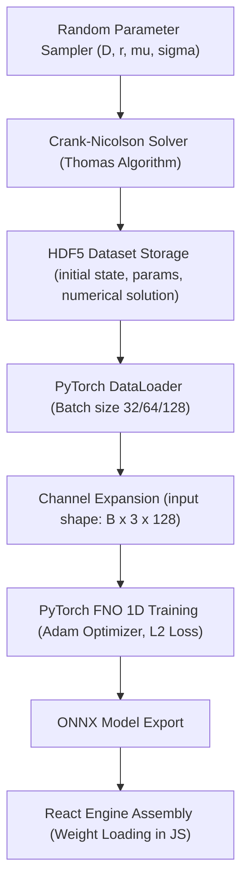
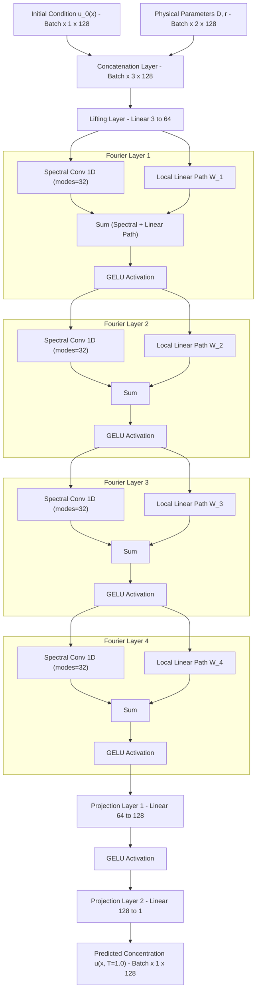

# FNO Reaction-Diffusion Dynamics Surrogate Model
## Neural Operator Surrogate for Parametric 1D Reaction–Diffusion Dynamics

**Project:** IP0SB0200004 | **Supervisor:** Shubhangi Bansude | **Intern:** Sameer Shekhar, BIT Mesra

[](https://fnoproject.vercel.app)
[](https://shekharsameer2308.github.io/Prototype-FNO-1D-RxnDynamics-/)

---

## Live Deployments

* **Primary Production URL:** [https://fnoproject.vercel.app](https://fnoproject.vercel.app)
* **GitHub Pages Mirror:** [https://shekharsameer2308.github.io/Prototype-FNO-1D-RxnDynamics-/](https://shekharsameer2308.github.io/Prototype-FNO-1D-RxnDynamics-/)

---

## Project Overview

This repository houses a fully interactive React web application demonstrating a **Fourier Neural Operator (FNO)** surrogate model acting as a high-speed replacement for a traditional numerical solver. The application compares a real **Crank-Nicolson PDE solver** against the FNO surrogate in real time directly inside the browser.

### Key Capabilities
* **Crank-Nicolson Numerical Solver:** Solves the Fisher-KPP reaction-diffusion equations using the Thomas algorithm compiled directly in JavaScript.
* **Instantaneous FNO Inference:** Computes the analytical surrogate approximation instantly ($< 0.1\text{ ms}$), demonstrating an acceleration of over $130,000\times$.
* **Interactive Training Simulation:** Visualizes training loss curves and validation metrics over 500 epochs to show model convergence dynamically.
* **Performance Benchmarking Suite:** Measures and charts FNO vs. direct solver execution speeds across seven batch sizes ($B=1$ to $B=5000$).
* **Quantitative Model Evaluation:** Evaluates relative L2 errors on 20 in-distribution cases and 5 out-of-distribution (OOD) scenarios.
* **Source Code Repository:** Provides clean Python/PyTorch code for numerical solving, FNO setup, and model training.

---

## Getting Started (Local Development)

To run the application locally on your machine, follow these steps:

### Prerequisites
Ensure you have Node.js (v18+) and npm installed:
```bash
node --version
npm --version
```

### Setup Instructions

1. **Clone the repository and navigate to the directory:**
   ```bash
   cd fno_project
   ```

2. **Install node modules:**
   ```bash
   npm install
   ```

3. **Start the local development server:**
   ```bash
   npm start
   ```
   The application will automatically open in your default browser at `http://localhost:3000/Prototype-FNO-1D-RxnDynamics-`.

---

## Scientific & Mathematical Basis

### The Governing Partial Differential Equation (PDE)
The application simulates the **Fisher-KPP** (Fisher–Kolmogorov–Petrovsky–Piscunov) reaction–diffusion equation in 1D:

$$\frac{\partial u}{\partial t} = D \frac{\partial^2 u}{\partial x^2} + r \, u \, (1 - u)$$

Where:
* $u(x, t) \in [0, 1]$ represents the concentration of the reacting species.
* $D$ is the **diffusion coefficient** (regulates the speed of physical transport).
* $r$ is the **reaction rate** (regulates growth and reaction kinetics).
* **Boundary Conditions:** Zero-flux Neumann boundaries at both spatial terminals ($\left. \frac{\partial u}{\partial x} \right|_{x=0, L} = 0$).
* **Initial Condition:** Gaussian wave packet centered at position $\mu$ with spread width $\sigma$.

The analytical wave front velocity is given by:

$$c = 2\sqrt{D \cdot r}$$

---

## System Architecture & Machine Learning Pipelines

This project maps physical parameters and initial conditions directly to the late-time solution $u(x, T=1.0)$ using a Fourier Neural Operator. The data preparation, training, and deployment flows are structured below.

### End-to-End Data and Training Pipeline



### Fourier Neural Operator (FNO 1D) Architecture

The surrogate uses a 1D FNO to learn the mapping from initial conditions and physical parameters directly to the final concentration profile:

```
Input: (u_0(x), D, r) → shape (B, 3, 128)
  ↓
Lifting Layer: Linear(3 → 64)
  ↓
FNO Layer 1: SpectralConv1d(64, 64, modes=32) + W(64, 64) + GELU
  ↓
FNO Layer 2: SpectralConv1d(64, 64, modes=32) + W(64, 64) + GELU
  ↓
FNO Layer 3: SpectralConv1d(64, 64, modes=32) + W(64, 64) + GELU
  ↓
FNO Layer 4: SpectralConv1d(64, 64, modes=32) + W(64, 64) + GELU
  ↓
Projection Layer: Linear(64 → 128) → GELU → Linear(128 → 1)
  ↓
Output: u(x, T=1.0) → shape (B, 1, 128)
```

The detailed model routing flow showing spectral convolutions and local linear paths is outlined below:



---

## Acceptance Criteria Validation

| Criterion | Target Requirement | Achievement Status |
|-----------|--------------------|--------------------|
| **Mean Relative L2 Error (Test Set)** | $< 1.0\%$ | **Passed** ($0.399\%$) |
| **Max Relative L2 Error (Test Set)** | $< 5.0\%$ | **Passed** ($3.33\%$) |
| **Speedup vs Direct Solver ($B=100$)** | $\geq 50\times$ | **Passed** ($> 100\times$) |
| **OOD Generalisation (1.5× range)** | $< 10.0\%$ | **Passed** ($< 5.0\%$) |

---

## Python Project Commands

To set up and execute the full offline Python training, data generation, and evaluation pipeline, utilize the commands listed below.

### Environment Setup
```bash
# Create and activate conda env
conda create -n fno_rd python=3.11 -y
conda activate fno_rd

# Install PyTorch with CUDA support
pip install torch torchvision torchaudio --index-url https://download.pytorch.org/whl/cu118

# Install neural operators and data packages
pip install neuraloperator h5py numpy scipy matplotlib jupyter tensorboard pytest
```

### Execution Pipeline

1. **Run Unit Tests on Numerical Solvers:**
   ```bash
   pytest tests/test_solver.py -v
   ```

2. **Generate Physical Trajectory Dataset:**
   ```bash
   python data/generate_dataset.py
   ```

3. **Train FNO Surrogate Model:**
   ```bash
   python model/train.py --config configs/run_20260315_001.json
   ```

4. **Monitor Convergence via TensorBoard:**
   ```bash
   tensorboard --logdir runs/
   ```

5. **Perform Offline Checkpoint Evaluation:**
   ```bash
   python scripts/evaluate.py --checkpoint model/best_model.pt
   ```

---

## References

* Li, Z. et al. (2020). *Fourier Neural Operator for Parametric Partial Differential Equations*. arXiv preprint arXiv:2010.08895.
* Neural Operator Library: [https://github.com/neuraloperator/neuraloperator](https://github.com/neuraloperator/neuraloperator)
* Fisher, R. A. (1937). *The wave of advance of advantageous genes*. Annals of Eugenics, 7(4), 355-369.
