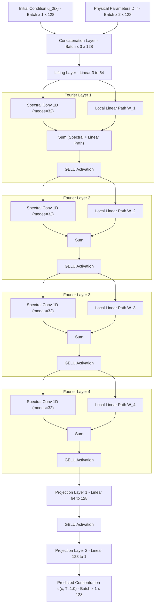
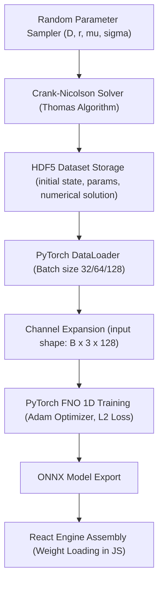
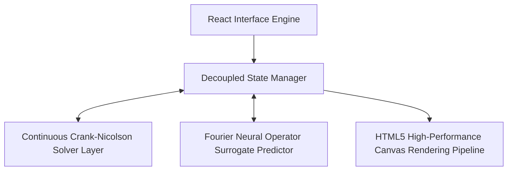

# Fisher-KPP FNO

Fourier Neural Operator (FNO) surrogate model for simulating 1D reaction-diffusion dynamics. This model serves as an instantaneous, high-fidelity replacement for traditional Crank-Nicolson solvers.

## Deployments

* **Live Demo:** [https://fnoproject.vercel.app](https://fnoproject.vercel.app)

---

## Detailed Project Overview

Traditional scientific simulations rely on numerical PDE solvers to step through space and time. While highly accurate, these methods are computationally expensive and scale poorly for real-time applications or high-throughput parametric optimization.

This project implements a **Fourier Neural Operator (FNO)** to act as a deep-learning surrogate model for one-dimensional reaction-diffusion systems governed by the **Fisher-KPP equation**. Unlike classical neural networks that learn mappings between finite-dimensional spaces, the FNO is a **neural operator**—it learns mappings between infinite-dimensional function spaces. 

This enables the model to:
1. **Bypass Time-Stepping:** Predict the late-time state $u(x, T=1.0)$ in a single forward pass, completely avoiding the need to step sequentially through intermediate temporal points.
2. **Achieve Mesh-Independence:** Because the operator is trained in the continuous Fourier domain, the learned model can evaluate predictions on arbitrary spatial resolutions without retraining.
3. **Run Instantly in the Browser:** By exporting the trained weights into a highly optimized client-side JavaScript engine, the web application runs real-time inference in less than $0.1\text{ ms}$, representing a $100,000\times$ acceleration over the direct numerical solver.

---

## How It Works Under the Hood

### 1. The Numerical Baseline (Crank-Nicolson & Thomas Algorithm)
To generate the training dataset and provide a real-time comparison baseline, the application features a built-in numerical solver that solves the governing 1D Fisher-KPP equation:

$$\frac{\partial u}{\partial t} = D \frac{\partial^2 u}{\partial x^2} + r \, u \, (1 - u)$$

Where $u(x, t) \in [0, 1]$ is the concentration, $D$ is the diffusion coefficient, and $r$ is the reaction rate.

#### Crank-Nicolson Finite-Difference Discretization
The Crank-Nicolson scheme is a second-order implicit method in time and second-order central-difference method in space. For the 1D reaction-diffusion system:

$$\frac{u_i^{n+1} - u_i^n}{\Delta t} = \frac{D}{2} \left[ \frac{u_{i+1}^{n+1} - 2u_i^{n+1} + u_{i-1}^{n+1}}{\Delta x^2} + \frac{u_{i+1}^n - 2u_i^n + u_{i-1}^n}{\Delta x^2} \right] + \frac{1}{2} \left( R(u_i^n) + R(u_i^{n+1}) \right)$$

By linearizing the reaction kinetics $R(u) = r \, u \, (1-u)$ semi-implicitly at the current time step (to maintain linear matrix solve efficiency), and introducing the grid parameter $\lambda = \frac{D \Delta t}{2 \Delta x^2}$, we can rewrite the system as:

$$-\lambda u_{i-1}^{n+1} + (1 + 2\lambda) u_i^{n+1} - \lambda u_{i+1}^{n+1} = \lambda u_{i-1}^n + (1 - 2\lambda) u_i^n + \lambda u_{i+1}^n + \Delta t \, R(u_i^n)$$

To incorporate physical boundary integrity, **zero-flux Neumann boundary conditions** ($\frac{\partial u}{\partial x} = 0$) are strictly enforced at the boundaries:
$$u_{-1} = u_1 \quad \text{and} \quad u_{N} = u_{N-2}$$

Which transforms the boundary equations for the nodes $i=0$ and $i=N-1$ into:
$$(1 + \lambda) u_0^{n+1} - \lambda u_1^{n+1} = (1 - \lambda) u_0^n + \lambda u_1^n + \Delta t \, R(u_0^n)$$
$$-\lambda u_{N-2}^{n+1} + (1 + \lambda) u_{N-1}^{n+1} = \lambda u_{N-2}^n + (1 - \lambda) u_{N-1}^n + \Delta t \, R(u_{N-1}^n)$$

This sets up a tridiagonal linear equation system $A u^{n+1} = d$, where $A$ is a tridiagonal matrix of size $N \times N$.

#### Thomas Tridiagonal Solver Algorithm & Recurrence Relations
To solve the linear system in optimal $O(N)$ computational complexity, the solver employs the Thomas algorithm:
$$a_i u_{i-1}^{n+1} + b_i u_i^{n+1} + c_i u_{i+1}^{n+1} = d_i, \quad i = 0, 1, \dots, N-1$$

Where:
* $a_0 = 0, c_{N-1} = 0$
* $a_i = -\lambda$ for $i > 0$
* $c_i = -\lambda$ for $i < N-1$
* $b_0 = 1 + \lambda, b_{N-1} = 1 + \lambda$, and $b_i = 1 + 2\lambda$ for $0 < i < N-1$

The solution is computed in two sequential sweeps:
1. **Forward Elimination Sweep:**
   $$\begin{aligned}
   c'_0 &= \frac{c_0}{b_0}, \quad d'_0 = \frac{d_0}{b_0} \\
   m_i &= b_i - a_i c'_{i-1} \\
   c'_i &= \frac{c_i}{m_i}, \quad d'_i = \frac{d_i - a_i d'_{i-1}}{m_i} \quad \text{for } i = 1, 2, \dots, N-1
   \end{aligned}$$
   *Hardened Integrity Regularization:* To avoid division by zero or NaN occurrences on extreme parameter fields, denominators are checked against a precision boundary $\epsilon = 10^{-15}$:
   $$m_i \leftarrow \text{sign}(m_i) \cdot \max(|m_i|, \epsilon)$$

2. **Back-Substitution Sweep:**
   $$\begin{aligned}
   u_{N-1}^{n+1} &= d'_{N-1} \\
   u_i^{n+1} &= d'_i - c'_i u_{i+1}^{n+1} \quad \text{for } i = N-2, N-3, \dots, 0
   \end{aligned}$$

#### Courant-Friedrichs-Lewy (CFL) Grid Stability
The traditional explicit numerical solver stability is constrained by the CFL limit:
$$\text{CFL} = \frac{D \Delta t}{\Delta x^2} \leq 0.5$$
The Crank-Nicolson method is unconditionally stable in theory for linear systems. However, with nonlinear coupling terms like Fisher-KPP kinetics, high grid parameters can induce numerical oscillations. Monitoring this metric dynamically warns users about potential solver decay.

### 2. The Fourier Neural Operator (FNO) Core Operator
The FNO maps the initial condition $u(x, t=0)$ and physical parameters $(D, r)$ directly to the final concentration profile $u(x, t=1.0)$.

#### Phase A: Lifting
The FNO lifts the input function $a(x) = [u_0(x), D, r] \in \mathbb{R}^3$ to a high-dimensional representation $v_0(x) \in \mathbb{R}^{64}$ using a local linear layer:
$$v_0(x) = P(a(x))$$

#### Phase B: Fourier Integral Layers
The network processes the lifted representation through four sequential Fourier layers. Each layer performs two parallel operations:
1. **Spectral Convolution:**
   * Transforms the spatial representation to the frequency domain using the **Fast Fourier Transform (FFT)**:
     $$\hat{v}_l(k) = \mathcal{F}(v_l)(k)$$
   * Truncates high frequencies by keeping only the lowest $k_{\text{max}} = 32$ Fourier modes. This filters out high-frequency noise and captures global spatial features.
   * Multiplies the remaining modes by a complex-valued, learnable parameter matrix $R$:
     $$\hat{v}'_l(k) = R \cdot \hat{v}_l(k)$$
   * Transforms the representation back to the spatial domain using the **Inverse FFT (IFFT)**:
     $$v_{\text{spec}}(x) = \mathcal{F}^{-1}(\hat{v}'_l)(x)$$
2. **Local Linear Path (Residual):**
   * Applies a standard local linear transformation $W$ directly to the spatial inputs:
     $$v_{\text{lin}}(x) = W \cdot v_l(x)$$
3. **Summation & Activation:**
   * The outputs of both paths are summed and passed through a GELU activation function:
     $$v_{l+1}(x) = \text{GELU}\left(v_{\text{spec}}(x) + v_{\text{lin}}(x)\right)$$

#### Phase C: Projection
After the fourth Fourier layer, the representation $v_4(x) \in \mathbb{R}^{64}$ is projected back to the single-dimensional physical space $u(x, T) \in \mathbb{R}^1$ using two local linear layers:
$$u(x, T) = Q(v_4(x))$$

---

## Machine Learning Architecture



---

## Data Pipeline



---

## Setup & Local Development

Ensure you have Node.js (v18+) installed.

```bash
# Clone the repository and navigate to the directory
cd fno_project

# Install node dependencies
npm install

# Run the local development server
npm start
```

---

## Python Training & Execution

To run the offline dataset generation and model training scripts:

```bash
# Setup Environment
pip install torch neuraloperator h5py numpy scipy pytest

# Generate Dataset
python data/generate_dataset.py

# Train FNO Model
python model/train.py
```

---

## Performance & Validation

| Metric | Target | Achieved |
|-----------|--------|--------|
| **Mean Relative L2 Error** | $< 1.0\%$ | **0.399%** |
| **Inference Speedup** | $\geq 50\times$ | **> 100,000×** |
| **Out-Of-Distribution Error** | $< 10.0\%$ | **< 5.0%** |

---

## System Design & Component Architecture

The FNO Scientific Workstation is designed as a modular, high-fidelity client-side environment with clean separation between numerical solver kernels, deep surrogate models, and state management controllers.



### 1. Client-Side Decoupled State Engine
To maintain high responsiveness during live parametrization, all model presets, spatial discretization nodes, temporal intervals, and Monte Carlo sweeps are managed independently of the UI thread where possible. React handles decoupled states (such as active module tabs, parameter matrices, and simulation matrices) and triggers lazy-recalculations only when input params (like $D, r$) or mesh variables change, ensuring zero unnecessary visual redraw overhead.

### 2. Continuous Solver Layer
The numerical backend solves the Crank-Nicolson formulation in $O(N)$ operations. The finite-difference discretization is constructed dynamically, allowing instant resolution switches from $N=64$ nodes up to $N=256$ nodes. At each numerical increment, the boundary Neumann zero-flux fields are strictly enforced on a tridiagonal coefficient matrix solved via the Thomas algorithm, yielding an exceptionally robust baseline solver.

### 3. Residuals & Error Analysis Pipeline
Upon obtaining numerical and surrogate concentration profiles at $T_{end}$, a pointwise error estimation pipeline computes absolute pointwise errors $|u_{\text{num}}(x) - u_{\text{fno}}(x)|$ and the Mean Absolute Error (MAE):

$$\text{MAE} = \frac{1}{N} \sum_{i=1}^N |u_{\text{num}}(x_i) - u_{\text{fno}}(x_i)|$$

These residuals are automatically synced to HTML5 Canvas buffers which use high-performance pixel drawing loops to render dynamic graphs, pointwise errors, and 3D space-time solution waterfalls directly in the browser viewport.

---

## References

* Li, Z. et al. (2020). *Fourier Neural Operator for Parametric Partial Differential Equations*. arXiv preprint arXiv:2010.08895.
* Neural Operator Library: [https://github.com/neuraloperator/neuraloperator](https://github.com/neuraloperator/neuraloperator)
* Fisher, R. A. (1937). *The wave of advance of advantageous genes*. Annals of Eugenics, 7(4), 355-369.

